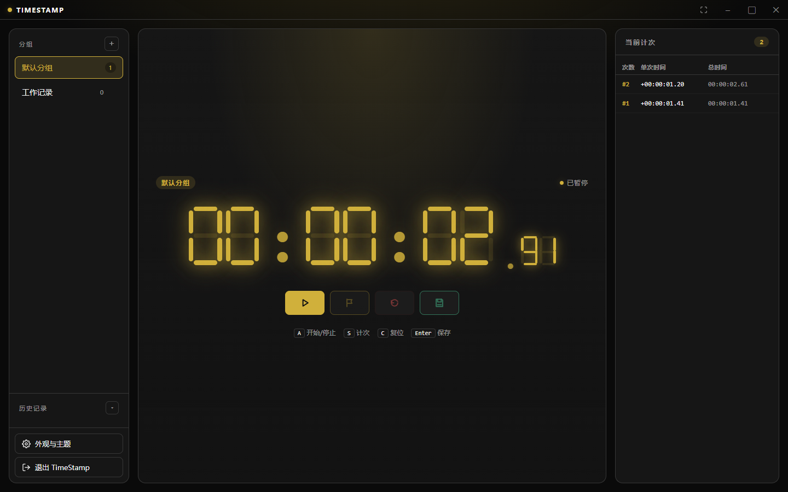
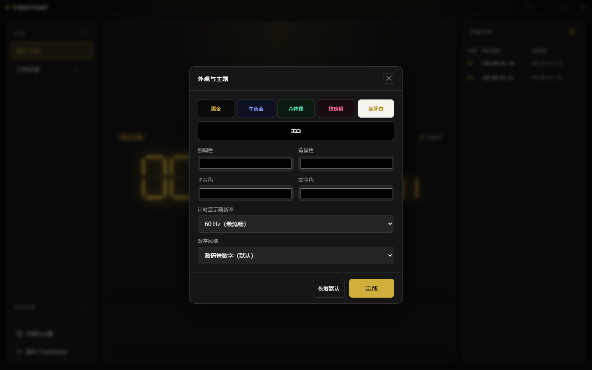

# TimeStamp

现代化离线秒表计时器（Electron 桌面应用）。默认数码管数字显示，支持分组管理、计次记录、历史持久化与完整的主题自定义。

## 截图





## 功能

- **高精度计时**：两位小数秒显示，`requestAnimationFrame` 平滑刷新
- **数码管数字**：默认七段数码管风格，也可切换为经典等宽数字
- **计次（Lap）**：记录单次时间与总时间，右侧面板实时展示
- **分组管理**：按用途（学习、训练、工作等）分组保存会话
- **历史记录**：所有会话本地持久化，侧边栏可折叠查看
- **主题自定义**：6 套预设（黑金 / 午夜蓝 / 森林绿 / 玫瑰粉 / 象牙白 / 黑白），也可手动调节强调色 / 背景色 / 卡片色 / 文字色
- **键盘快捷键**：
  - `A` 开始 / 暂停
  - `S` 计次
  - `C` 复位
  - `Enter` 保存当前会话
  - `F11` 切换无边框全屏
  - `Esc` 退出全屏
- **完全离线**：无需网络；数据保存在本地 `userData` 目录
- **无边框现代 UI**：自定义标题栏 + 渐变光效 + 毛玻璃弹层
- **自动发布**：推送 `v*` 标签后由 GitHub Actions 构建 Windows 安装包并发布到 Releases

## 运行

需要 Node.js 18+（推荐 20+）。

```bash
npm install
npm start
```

## 打包

```bash
npm run dist
```

产物在 `dist/` 下（Windows 默认输出 NSIS 安装包）。

## 自动发布

仓库包含 GitHub Actions 工作流：`.github/workflows/build-windows.yml`。

- 推送到 `main`：构建 Windows 安装包并上传为 Actions artifact
- 推送版本标签（例如 `v0.0.1`）：构建安装包，创建 GitHub Release，并上传 `.exe`、`.blockmap` 与 `latest.yml`

```bash
git tag v0.0.1
git push origin v0.0.1
```

## 数据存储位置

会话与设置保存为单个 JSON 文件：

- 安装版（给其他人分发）：`TimeStamp` 目录
- 开发版（`npm start` 本机调试）：`TimeStamp-Dev` 目录

示例（安装版）：
- Windows: `%APPDATA%/TimeStamp/timestamp-data.json`
- macOS:  `~/Library/Application Support/TimeStamp/timestamp-data.json`
- Linux:  `~/.config/TimeStamp/timestamp-data.json`

如需清空所有记录，直接删除该文件即可。

## 目录结构

```
TimeStamp/
├── package.json        应用与打包配置
├── main.js             Electron 主进程（窗口 / IPC / 持久化）
├── preload.js          安全桥接脚本
├── src/
│   ├── index.html      界面结构
│   ├── styles.css      黑金主题与主题变量
│   └── renderer.js     计时逻辑 / 分组 / 历史 / 主题
├── docs/
│   └── images/         README 截图
└── README.md
```

## 技术栈

- Electron 33（contextIsolation + preload，无 `nodeIntegration`）
- 原生 HTML / CSS / JS（零运行时依赖，启动快、体积小）
- 文件系统持久化（`fs` + `app.getPath('userData')`）
